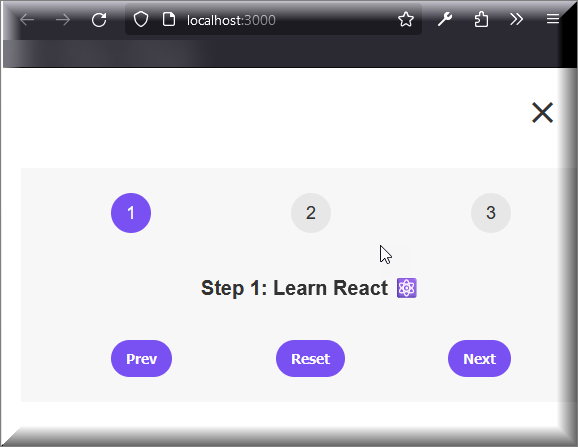

# Steps Component for React

This repository contains a simple React component called `Steps`, designed to guide users through a sequential process.



## Features

- Displays numbered steps with corresponding messages.
- Users can navigate between steps using "Prev" and "Next" buttons.
- Includes a "Reset" button to return to the initial step.

## Usage

1. **Installation**: Import the `Steps` component and its associated CSS file into your React project.
2. **Integration**: Incorporate the `Steps` component into your application to guide users through multi-step processes.
3. **Customization**: Modify the CSS or component logic as needed to suit your project requirements.

## Example

```jsx
import "./Steps.css";
import { Steps } from "./Steps";

function App() {
  return (
    <div className="App">
      <h1>Multi-Step Process</h1>
      <Steps />
    </div>
  );
}

export default App;
```

## Contributing

Contributions are welcome! Here's how you can contribute:

- Fork the repository.
- Create a new branch (`git checkout -b feature/your-feature`).
- Make your changes.
- Commit your changes (`git commit -am 'Add some feature'`).
- Push to the branch (`git push origin feature/your-feature`).
- Create a new Pull Request.

## License

This project is licensed under the [MIT License](LICENSE).

## Credits

This component is created and maintained by [Farhan Shahid](https://github.com/FSKhan19). Feel free to contribute, report issues, or suggest improvements.
