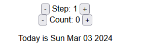

# React Counter App

This is a simple React application that demonstrates a counter with step control.



## Installation

1. Clone this repository to your local machine.
2. Navigate to the project directory.
3. Install dependencies using npm or yarn:

   ```bash
   npm install
   # or
   yarn install
   ```

## Usage

To run the application locally, use the following command:

```bash
npm start
# or
yarn start
```

This will start the development server and open the application in your default web browser.

## Features

- Increment and decrement the step value.
- Increment and decrement the counter value.
- See the calculated date based on the counter value.

## Contributing

Contributions are welcome! If you find any issues or have suggestions for improvements, please open an issue or submit a pull request.

Here's how you can contribute:

- Fork the repository.
- Create a new branch (`git checkout -b feature/your-feature`).
- Make your changes.
- Commit your changes (`git commit -am 'Add some feature'`).
- Push to the branch (`git push origin feature/your-feature`).
- Create a new Pull Request.

## License

This project is licensed under the [MIT License](LICENSE).

## Credits

This component is created and maintained by [Farhan Shahid](https://github.com/FSKhan19). Feel free to contribute, report issues, or suggest improvements.
