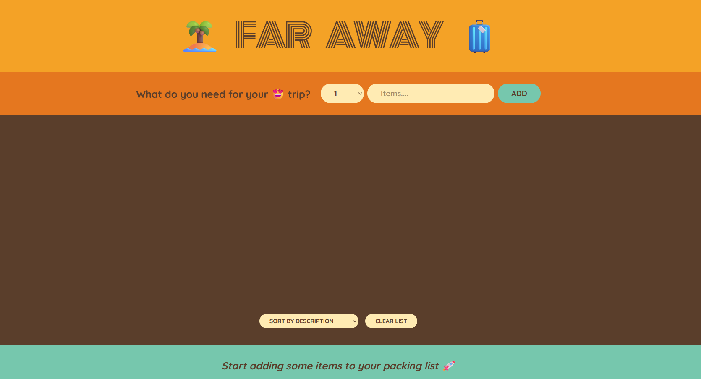

# Far Away Packing List App

This is a simple React application for managing a packing list for a trip. Users can add items they need for their trip, mark items as packed, delete items, and view statistics about their packing progress.

## Table of Contents

- [Features](#features)
- [Installation](#installation)
- [Usage](#usage)
- [Components](#components)
  - [App](#app)
  - [Logo](#logo)
  - [Form](#form)
  - [Packaging List](#packaging-list)
  - [Item](#item)
  - [Stats](#stats)
- [Contributing](#contributing)
- [License](#license)
- [Credits](#credits)

## Features

- Add items to the packing list with a description and quantity
- Mark items as packed or unpacked
- Delete items from the list
- Sort items by input order, description, or packed status
- View statistics about packing progress

## Installation

1. Clone the repository: `git clone https://github.com/your/repository.git`
2. Navigate to the project directory: `cd packing-list-app`
3. Install dependencies: `npm install`
4. Start the development server: `npm start`
5. Open your browser and navigate to `http://localhost:3000` to view the app.

## Usage

1. Enter the description and quantity of the item you need for your trip in the input fields.
2. Click the "Add" button to add the item to your packing list.
3. Check the checkbox next to an item to mark it as packed or unpacked.
4. Click the "❌" button to delete an item from the list.
5. Use the dropdown menu to sort items by input order, description, or packed status.
6. Click the "Clear list" button to delete all items from the list.
7. View statistics about your packing progress in the footer.

## Components

### App

The main component that renders the logo, form for adding items, packaging list, and statistics.

### Logo

A simple component that displays the logo of the app.

### Form

A form component where users can input the description and quantity of items they need for their trip. When submitted, it adds the item to the packing list.

### Packaging List

A component that displays the list of items added by the user. Users can delete items, mark items as packed or unpacked, and sort items by input order, description, or packed status.

### Item

A component that represents an individual item in the packing list. It displays the item's quantity, description, and packed status. Users can toggle the packed status and delete the item.

### Stats

A component that displays statistics about the packing progress, including the total number of items, the number of items packed, and the percentage of items packed.

## Contributing

Contributions are welcome! If you find any issues or have suggestions for improvements, please open an issue or submit a pull request.

Here's how you can contribute:

- Fork the repository.
- Create a new branch (`git checkout -b feature/your-feature`).
- Make your changes.
- Commit your changes (`git commit -am 'Add some feature'`).
- Push to the branch (`git push origin feature/your-feature`).
- Create a new Pull Request.

## License

This project is licensed under the [MIT License](LICENSE).

## Credits

This component is created and maintained by [Farhan Shahid](https://github.com/FSKhan19). Feel free to contribute, report issues, or suggest improvements.
