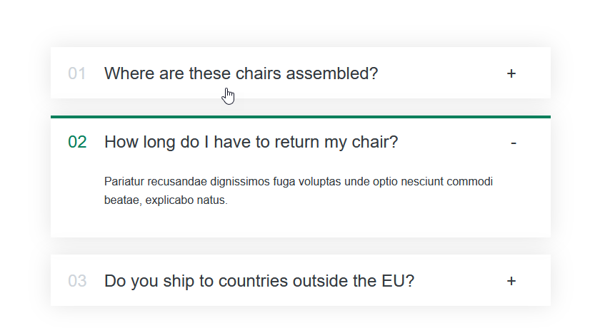

# FAQ Accordion Component

This project implements a simple FAQ accordion component using React.

## Table of Contents

- [Features](#features)
- [Installation](#installation)
- [Usage](#usage)
- [Components](#components)
  - [App](#app)
  - [Accordion](#accordion)
  - [AccordionItem](#accordionitem)
- [Contributing](#contributing)
- [License](#license)
- [Credits](#credits)

## Features

- Displays a list of frequently asked questions in an accordion format.
- Users can expand or collapse individual FAQ items by clicking on them.

## Installation

1. Clone the repository: `git clone https://github.com/FSKhan19/ReactLearning.git`
2. Navigate to the project directory: `cd your-project-directory`
3. Install dependencies: `npm install`

## Usage

1. Import the `Accordion` component into your React application.
2. Pass an array of FAQ objects to the `faqs` prop of the `Accordion` component.
3. Each FAQ object should have `title` and `text` properties.
4. The `Accordion` component will render an accordion interface with the provided FAQs.

## Components

### App

The main component that renders the `Accordion` component.

### Accordion

A component that takes an array of FAQ objects and renders an accordion interface.

Props:

- `faqs`: An array of objects containing FAQ data.

### AccordionItem

A component that represents an individual FAQ item within the accordion.

Props:

- `num`: The index of the FAQ item.
- `title`: The title of the FAQ item.
- `text`: The text content of the FAQ item.

## Contributing

Contributions are welcome! If you find any issues or have suggestions for improvements, please open an issue or submit a pull request.

Here's how you can contribute:

- Fork the repository.
- Create a new branch (`git checkout -b feature/your-feature`).
- Make your changes.
- Commit your changes (`git commit -am 'Add some feature'`).
- Push to the branch (`git push origin feature/your-feature`).
- Create a new Pull Request.

## License

This project is licensed under the [MIT License](LICENSE).

## Credits

This component is created and maintained by [Farhan Shahid](https://github.com/FSKhan19). Feel free to contribute, report issues, or suggest improvements.
